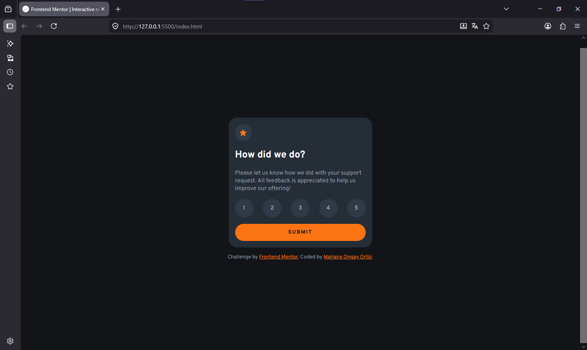
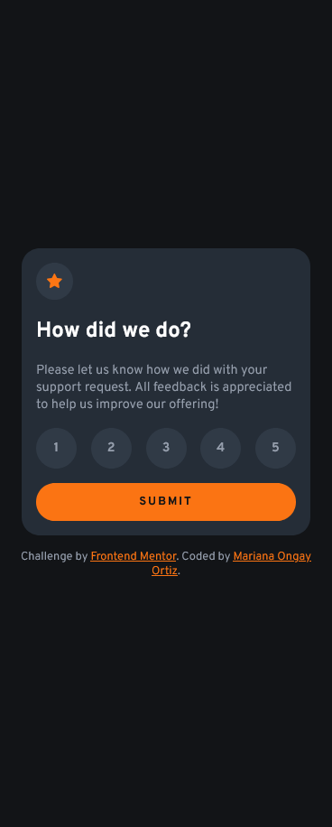
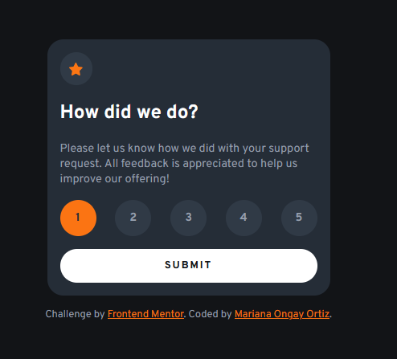
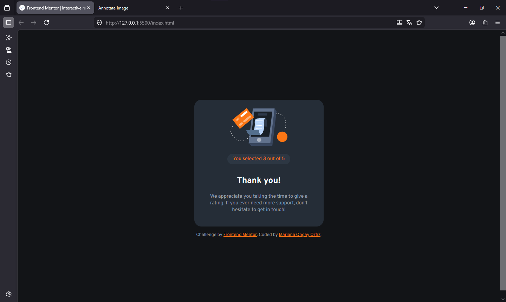

# Frontend Mentor - Interactive rating component solution

Solución de  [Interactive rating component challenge on Frontend Mentor](https://www.frontendmentor.io/challenges/interactive-rating-component-koxpeBUmI).

### Screenshot

Desktop

Mobile

Active States

Thank You card

### Comandos

    npm install

    npm install -g sass

    sass scss/styles.scss css/styles.css

    sass --watch scss:css

## Author

- Website - Mariana Ongay Ortiz
- Frontend Mentor - [@MarianaOngay17](https://www.frontendmentor.io/profile/MarianaOngay17)
